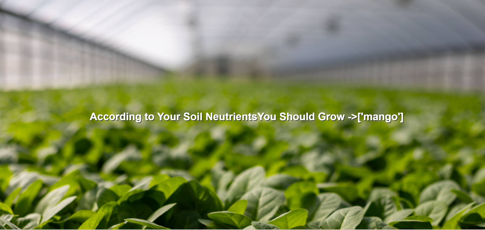

# Crop Selection Project

Welcome to the Crop Selection project repository! This project is designed to help farmers make informed decisions about crop selection based on soil features. Whether you're a seasoned farmer or just starting, this tool can provide valuable insights into the most suitable crops for your field.

## Project Overview

In this project, we leverage machine learning techniques to predict the recommended crops based on soil characteristics. The dataset includes essential features such as Nitrogen, Phosphorus, Potassium, Temperature, Humidity, pH, and Rainfall. The model is trained on 80% of the data and achieves impressive accuracy rates:

- Linear Regression: 97.05% accuracy
- Decision Tree Model: 99.55% accuracy
- Random Forest Model: 99.55% accuracy

Considering the high accuracy and lower time complexity, the Decision Tree model has been chosen as the final model for this project.

## How It Works

The Crop Selection tool utilizes a Decision Tree model trained on a diverse dataset of 2200 samples. The model analyzes soil features and predicts the most profitable crops for cultivation.

## Getting Started

To use the Crop Selection tool, follow these simple steps:

1. **Run The Link:**
Visit '''http://127.0.0.1:5000''' in your web browser to interact with the Crop Selection tool and tap on PREDICT.

2.**Enter the Details about your Soil:**
Now after providing the details of your soil enter SUBMIT.

3.**Your Result is Ready:**
Now you will see the suggested crop.

Wish you a profitable cultivation.

  

